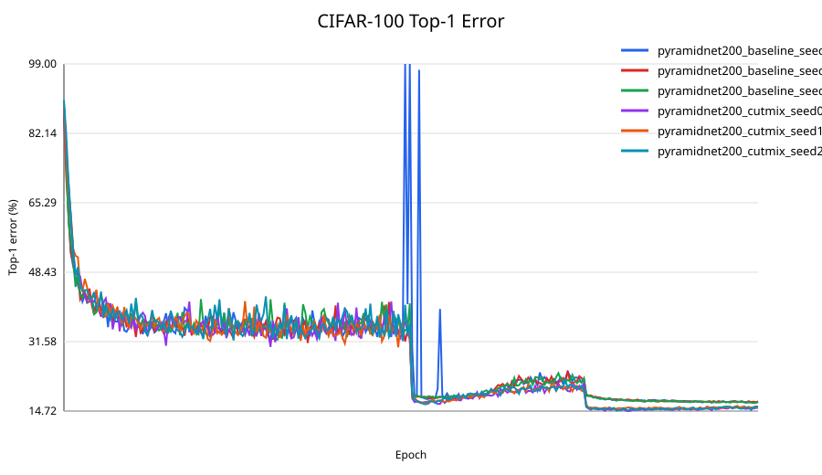
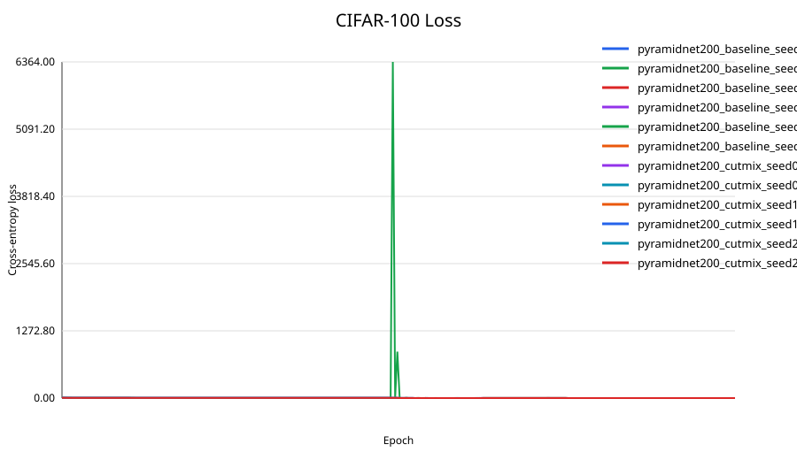

# CutMix CIFAR-100 復現：RTX 3070 Ti 8GB、單 GPU、六次完整訓練

> 用現代 PyTorch 在 CIFAR-100 上重現論文 **CutMix: Regularization Strategy to Train Strong Classifiers with Localizable Features** 的核心分類實驗：PyramidNet-200 baseline 對比 PyramidNet-200 + CutMix。

本專案不是只有一份範例程式。它包含可執行的訓練流程、顯存安全檢查、單元測試、兩階段 resume 測試、六次 300-epoch 正式實驗、逐 epoch 原始紀錄、圖表與完整結果報告。

## 一眼看懂結果

錯誤率越低越好；`±` 是三個 seeds 的樣本標準差。

| 方法 | 論文 Top-1 error | 本次 Top-1 error | 與論文差距 | 本次相對 Baseline 改善 |
|---|---:|---:|---:|---:|
| PyramidNet-200 Baseline | 16.45% | **16.740 ± 0.085%** | +0.290 pp | - |
| PyramidNet-200 + CutMix | 14.47% | **14.883 ± 0.217%** | +0.413 pp | **1.857 pp** |

論文的 CutMix 改善量是 `16.45 - 14.47 = 1.98` 個百分點；本次是 `16.740 - 14.883 = 1.857` 個百分點，重現了約 **93.8% 的論文改善幅度**。三個配對 seeds 全部都由 CutMix 勝出，因此核心結論重現成功，但絕對數字沒有假裝成與論文完全相同。

> [!IMPORTANT]
> 論文 Table 5 的 14.47% 是三次實驗各自最佳表現的平均。官方 repository 的 14.23% 是單一已發布 checkpoint；兩者定義不同，不能混寫。

### 每個 seed 的結果

下表的 Top-5 是「Best Top-1 checkpoint 當下的 Top-5」，確保同一列來自同一個模型檔。

| 方法 | Seed | Best Top-1 | Best Top-5 | Best epoch | Epoch 300 Top-1 | Epoch 300 Top-5 | 時間 |
|---|---:|---:|---:|---:|---:|---:|---:|
| Baseline | 0 | 16.73% | 3.50% | 295 | 16.91% | 3.60% | 13.063 h |
| Baseline | 1 | 16.83% | 3.70% | 282 | 17.05% | 3.59% | 12.797 h |
| Baseline | 2 | 16.66% | 3.66% | 298 | 16.96% | 3.65% | 12.942 h |
| CutMix | 0 | 14.72% | 3.02% | 244 | 15.49% | 3.39% | 13.074 h |
| CutMix | 1 | 15.13% | 3.47% | 268 | 15.57% | 3.48% | 12.934 h |
| CutMix | 2 | 14.80% | 3.11% | 239 | 15.82% | 3.38% | 13.098 h |

同 seed 的 Top-1 改善分別是 **2.01、1.70、1.86 pp**，平均 **1.857 ± 0.155 pp**。六次正式訓練合計約 **77.91 GPU 小時**。

### 訓練曲線





CutMix 的 train loss 和 baseline 不能直接比大小：CutMix 計算的是兩個整數 class target 的加權交叉熵，訓練目標本來就比較困難。應比較 validation loss、Top-1／Top-5 error 與同 seed 改善量。

## 復現範圍

### 本次有做

- CIFAR-100 分類。
- Bottleneck PyramidNet-200，widening alpha 240，26,844,952 parameters。
- Baseline seeds 0、1、2。
- CutMix seeds 0、1、2。
- 每組 300 epochs。
- 8GB 顯存 preflight、AMP、checkpoint、完整 resume 與 RNG state 還原。
- 每 epoch CSV、每 run JSON、彙總表、loss/error 曲線與復現報告。

### 刻意沒有做

- ImageNet 下載或訓練。
- 物件偵測、圖像描述、WSOL 或完整 OOD 實驗。
- DataParallel、DDP 或任何多 GPU 假設。
- 為追數字而偷偷調參、刪除失敗 seed 或只挑最好看的單次結果。

## 論文設定與本次設定

Baseline 與 CutMix 除了 CutMix 增強本身，其餘設定完全一致。

| 項目 | 設定 |
|---|---|
| Dataset | CIFAR-100 |
| Model | PyramidNet-200，bottleneck，alpha=240 |
| Epochs | 300 |
| Effective batch size | 64 |
| Initial learning rate | 0.25 |
| LR schedule | epoch 150、225 各乘 0.1 |
| Optimizer | SGD |
| Momentum / weight decay | 0.9 / 1e-4 |
| Nesterov | True |
| CutMix Beta | Beta(1, 1) |
| CutMix probability | 0.5 |
| Training transform | RandomCrop(32, padding=4)、RandomHorizontalFlip、ToTensor、Normalize |
| Mean | `[125.3, 123.0, 113.9] / 255` |
| Std | `[63.0, 62.1, 66.7] / 255` |
| Device | 只使用 `cuda:0` |
| Precision | PyTorch AMP + GradScaler |

## CutMix 實作重點

`src/cutmix_repro/cutmix.py` 遵守論文與官方程式的核心方法：

1. 在同一個 mini-batch 內隨機排列樣本。
2. 從 `Beta(1, 1)` 抽樣 lambda。
3. 矩形寬高比例使用 `sqrt(1 - lambda)`。
4. 把第二張影像的矩形區塊貼進第一張。
5. 座標經邊界裁切後，以實際貼入面積重新計算 lambda。
6. Loss 為 `lambda * CE(output, target_a) + (1-lambda) * CE(output, target_b)`。
7. Target 保持整數 class index，不建立 one-hot label。
8. 不使用已棄用的 `np.int`。
9. 驗證使用 `model.eval()` 與 `torch.inference_mode()`。

## 8GB VRAM 安全結果

安全上限是 `min(7.2 GiB, CUDA 總顯存的 90%)`，本機實際為 **7.200 GiB**。

正式訓練前，每個候選 batch 都執行五次完整 AMP forward、backward、optimizer steps：

| Training micro-batch | Peak reserved | 結果 | 對應 accumulation |
|---:|---:|---|---:|
| 64 | 5.309 GiB | Safe，採用 | 1 |
| 32 | 2.765 GiB | Safe | 2 |
| 16 | 1.500 GiB | Safe | 4 |
| 8 | 0.943 GiB | Safe | 8 |

Validation batch 64 也通過。六次正式訓練的最大 peak reserved VRAM 是 **5.334 GiB**，距離上限仍有約 **1.866 GiB**。最終使用 micro-batch 64、accumulation 1，因此沒有因縮小 micro-batch 而改變本次 BatchNorm 統計。

程式另外使用：

- `optimizer.zero_grad(set_to_none=True)`。
- Dataset 與完整 batch 保留在 CPU，需要時才把目前 batch 搬到 GPU。
- 禁用 DataParallel／DDP。
- 每個 epoch 重設並記錄 peak allocated／reserved VRAM。
- 正式訓練不依靠 OOM 後繼續；OOM 只允許出現在受控 preflight。

## 實際軟硬體環境

| 項目 | 實際版本 |
|---|---|
| OS | Windows 11 10.0.26100 |
| CPU | Intel Core i7-11700K |
| RAM | 32GB |
| GPU | NVIDIA GeForce RTX 3070 Ti 8GB |
| Python | 3.12.14 |
| PyTorch | 2.12.1+cu126 |
| torchvision | 0.27.1+cu126 |
| NumPy | 2.5.2 |
| CUDA runtime | 12.6 |
| cuDNN | 91002 |
| NVIDIA driver | 591.86 |

每一次執行的實際環境也保存在對應 `metadata.json`，不只依賴這張手寫表格。

## 從乾淨環境開始

### 1. 建立 Python 環境

```powershell
powershell -ExecutionPolicy Bypass -File .\scripts\setup_windows.ps1
$env:PYTHONPATH = "$PWD\src"
.\.venv\Scripts\python.exe -m pytest
```

若已經有相容的 CUDA PyTorch 環境，也可以直接安裝：

```powershell
python -m pip install -r requirements.txt
$env:PYTHONPATH = "$PWD\src"
python -m pytest
```

本專案不強制安裝 2019 年的舊版 PyTorch；方法在現代版本上重現。

### 2. 準備 CIFAR-100

資料預設位置是 `data/`。資料集不提交到 Git，請使用 torchvision 下載，或把既有 CIFAR-100 放到此目錄。`data.root` 也可以在 TOML 設定中修改。

### 3. 先跑 VRAM preflight

```powershell
powershell -ExecutionPolicy Bypass -File .\scripts\run_preflight.ps1
```

結果寫入 `outputs/preflight/report.json`。正式訓練會讀取這份報告，自動選擇安全的 micro-batch 與 validation batch。

### 4. 跑單元測試及兩階段 resume smoke test

```powershell
powershell -ExecutionPolicy Bypass -File .\scripts\run_smoke_and_resume.ps1
```

Smoke test 使用完整 PyramidNet-200 和少量資料：第一段只跑 epoch 1，第二段由 checkpoint 恢復到 epoch 2。Train loss 由 **4.6273 降到 4.5470**。Smoke-only LR 是 0.01，避免把完整資料集的 LR 0.25 套在 1,024 筆小資料上；正式設定仍為 0.25。

Checkpoint 會保存及還原：

- model state。
- optimizer state。
- GradScaler state。
- 目前 epoch／scheduler 進度。
- best metrics。
- Python、NumPy、PyTorch CPU、PyTorch CUDA RNG states。
- 完整 config。

### 5. 正式訓練

先跑 seed 0：

```powershell
powershell -ExecutionPolicy Bypass -File .\scripts\run_experiments.ps1 -Seeds 0
```

再跑 seeds 1、2：

```powershell
powershell -ExecutionPolicy Bypass -File .\scripts\run_experiments.ps1 -Seeds 1,2
```

若要在背景執行並保留 log：

```powershell
powershell -ExecutionPolicy Bypass -File .\scripts\start_experiments.ps1 -Seeds 0
powershell -ExecutionPolicy Bypass -File .\scripts\show_status.ps1
```

如果中斷，執行同一命令會偵測 `last.pt` 並恢復。也可以直接指定：

```powershell
$env:PYTHONPATH = "$PWD\src"
.\.venv\Scripts\python.exe -m cutmix_repro.train `
  --config .\configs\cutmix.toml `
  --output .\outputs\experiments\pyramidnet200_cutmix_seed0 `
  --resume auto
```

### 6. 重新產生報告與圖表

```powershell
$env:PYTHONPATH = "$PWD\src"
.\.venv\Scripts\python.exe -m cutmix_repro.report
```

會更新：

- `outputs/experiments/comparison.csv`
- `outputs/experiments/error_curves.svg`
- `outputs/experiments/loss_curves.svg`
- `reproduction_report.md`

## 完整實驗過程

1. **工作區稽核**：先檢查相鄰 Random Erasing 專案、Git 狀態、Python、CUDA、PyTorch、CIFAR-100 與未提交修改；原始專案及資料均未覆寫。
2. **模型與 CutMix 實作**：移植官方 PyramidNet 結構到現代 PyTorch，移除固定 CUDA 配置與舊 NumPy API。
3. **單元測試**：驗證 CutMix shape、lambda 範圍、實際面積、label permutation、整數 targets、模型輸出／參數量與 RNG round-trip；最終 `4 passed`。
4. **VRAM preflight**：64、32、16、8 全部各跑五個完整訓練步驟，再獨立測 validation，選出 64／64。
5. **Smoke + resume**：先中斷再恢復，確認 loss 下降、CSV／JSON／checkpoint 正常，並實際檢查 checkpoint 必要 keys。
6. **第一階段**：完成 Baseline seed 0 與 CutMix seed 0；首個完整 epoch 的保守估算仍在六天門檻內。
7. **第二階段**：依優先順序完成 CutMix seeds 1、2，再完成 Baseline seeds 1、2。
8. **最終驗證**：六份 `metrics.csv` 各有 300 rows、沒有 NaN／Inf、所有 checkpoint epoch 均為 300、最大 reserved VRAM 未超標、測試再次全數通過。
9. **報告**：保留每個 seed，不刪除較差結果；同時報告 best、last、training time、VRAM、與論文差距及三次統計。

## 結果怎麼解讀

- **成功的部分**：三個 seeds 的 CutMix 都比相同 seed Baseline 好，平均改善 1.857 pp，非常接近論文的 1.98 pp。
- **沒有完全重現的部分**：本次 Baseline 與 CutMix 絕對 Top-1 error 都比論文高約 0.3 到 0.4 pp。
- **可能原因**：論文未公開相同 seeds、現代 PyTorch/CUDA/cuDNN、AMP、單 GPU 拓撲、浮點順序及 checkpoint 指標選擇方式都可能造成差異。
- **Best 與 last 不同**：論文比較 best performance；本次 CutMix 最後 epoch 平均 15.627%，比 best 平均 14.883% 差 0.743 pp，因此部署應使用 `best.pt`。
- **Top-5 定義**：主表使用 Best Top-1 checkpoint 當下的 Top-5；若每個 seed 獨立取最低 Top-5，Baseline 是 3.423 ± 0.055%，CutMix 是 2.873 ± 0.050%。兩種定義不能混用。

Baseline seed 0 在 epochs 148 與 150 有兩次短暫 validation spike，train loss 保持有限且下一個 epoch 恢復，最終 best 在 epoch 295。這項異常保留在原始 CSV 與曲線中，沒有刪除或隱藏。

更完整的逐項分析請看 [`reproduction_report.md`](reproduction_report.md)，機器可讀彙總請看 [`comparison.csv`](outputs/experiments/comparison.csv)。

## Repository 結構

```text
configs/                       Baseline、CutMix、smoke TOML 設定
scripts/                       Windows 安裝、preflight、smoke、訓練、監看腳本
src/cutmix_repro/              模型、CutMix、資料、runtime、訓練與報告程式
tests/                         CutMix、模型與 RNG 單元測試
outputs/preflight/             顯存測試 JSON
outputs/smoke/                 Smoke／resume 的小型 CSV、JSON 紀錄
outputs/experiments/           六次正式實驗 CSV、JSON、log、SVG 與比較表
reproduction_report.md         最終復現報告
1905.04899v2.pdf               本次研究使用的論文版本
```

## GitHub 檔案政策

以下內容提交 GitHub：

- 全部 Python／PowerShell 程式、TOML 設定與測試。
- README、最終報告、論文 PDF、第三方授權說明。
- Preflight、smoke、六次正式實驗的 CSV／JSON。
- 原始 batch stdout／stderr log、比較表與 SVG 曲線。

以下內容保留本機、不放入一般 Git：

- `data/`：CIFAR-100 原始資料，應由 torchvision 下載。
- `*.pt`：每個 checkpoint 約 206 MiB，超過 GitHub 一般 Git 的 100 MiB 單檔限制。
- `.venv/`、cache、`__pycache__`、暫存檔與只含本機 PID／絕對路徑的 `batch_process.json`。

未上傳 checkpoint 不代表結果缺失；所有逐 epoch 指標、設定、環境、摘要、圖表與可重建程式都在 repository。若需要散布權重，建議另用 GitHub Release asset 或具足夠配額的 Git LFS，並在上傳後補 checksum。

## 授權與來源

- 論文：[CutMix: Regularization Strategy to Train Strong Classifiers with Localizable Features](https://arxiv.org/abs/1905.04899)
- 官方程式：[clovaai/CutMix-PyTorch](https://github.com/clovaai/CutMix-PyTorch)
- 改寫自官方程式的授權文字保存在 [`LICENSE-CutMix-PyTorch.txt`](LICENSE-CutMix-PyTorch.txt)。
- 第三方說明請看 [`THIRD_PARTY_NOTICES.md`](THIRD_PARTY_NOTICES.md)。
